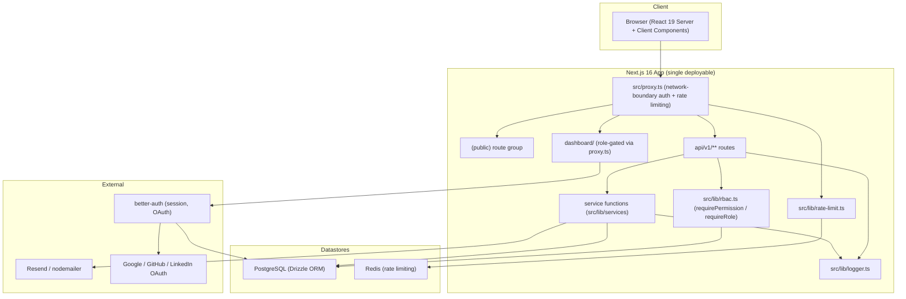
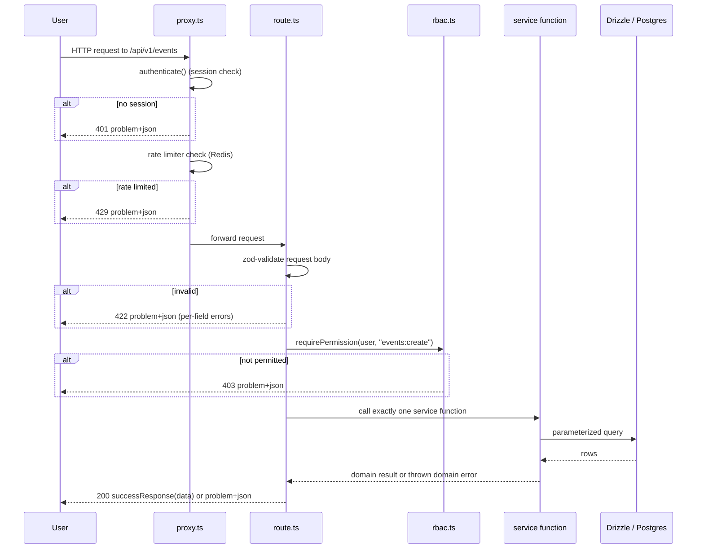
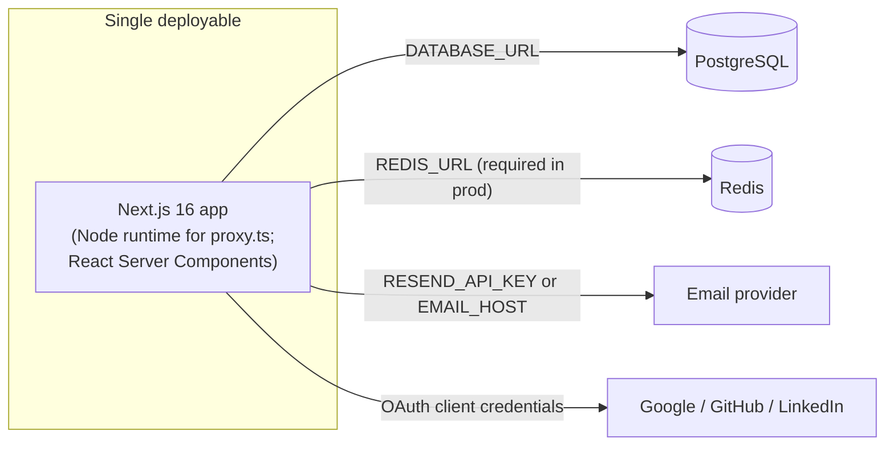

# 2. System Architecture

Supersedes `docs/architecture/overview.md`'s layering and route-group taxonomy sections. The ADR references that document cited remain the source of truth for the reasoning behind each decision; this document states the resulting shape precisely, including where the original taxonomy was aspirational rather than built.

## 2.1 Architecture style

Nuvia is a **modular monolith**: one Next.js application, one PostgreSQL database, one deployable artifact. Confirmed with the project owner during this spec's grill, against the alternative of a microservices split.

**Why this shape.** The project's own scale argument (`docs/PRINCIPLES.md`, "Scalable") is that Nuvia scales with an association's size, not with server count, and the single-association tenant seam (`docs/adr/0007-single-association-tenant-seam.md`) is designed so that scaling to multi-association later is additive to this same schema, not a rewrite into separate services. A microservices split would introduce network boundaries, independent deployables, and data-ownership questions that this project's actual failure mode (unauthorized mock modules, missing tests, drifted docs — see `CLAUDE.md`) does not need solved. Module boundaries are enforced by import discipline and the maturity gate (Section 13), not by process boundaries.

## 2.2 Component graph

## 2.3 Request lifecycle

## 2.4 Route-group taxonomy: target versus actual

`docs/architecture/overview.md` originally described three route groups: `(public)` (no session), `(authenticated)` (session, no specific role, layout-level `requirePermission`), and `(admin)` (session plus a specific permission, layout-level check). This is the target shape. The actual shape on disk today is narrower:

| Path                   | Group on disk                          | Enforcement mechanism today                                                                                                                                                                                                                                                                                                                                |
| ---------------------- | -------------------------------------- | ---------------------------------------------------------------------------------------------------------------------------------------------------------------------------------------------------------------------------------------------------------------------------------------------------------------------------------------------------------- |
| `src/app/(public)/**`  | Real Next.js route group `(public)`    | No session required. Zod validates input; the rate limiter applies. No mutation actions may be imported here (a lint/CI rule, `TODO.md` M2). Today this group incorrectly still contains two privileged pages (`events/[id]/edit`, `events/[id]/check-in`) that need to move; they carry their own `src/lib/require-dashboard-role.ts` check as a stopgap. |
| `src/app/dashboard/**` | Plain directory, **not** a route group | `src/proxy.ts` requires a session, then calls `isRoleAllowedForPath(pathname, user.role)` (`src/lib/dashboard-access.ts`), which looks up the longest-matching path entry in `src/lib/navigation-data.ts`'s per-item `roles` list. This is role-based, not permission-based, and happens in middleware, not in a route-group layout.                       |
| `src/app/api/v1/**`    | Plain directory                        | `src/proxy.ts`'s `createAuthMiddleware` requires a session (skipped for a short public-endpoint allow-list); each `route.ts` handler then calls `requirePermission` itself as its first real line.                                                                                                                                                         |

There is no `(authenticated)` or `(admin)` directory anywhere in `src/app`. A future migration to that taxonomy is tracked, not built; Section 5 and Section 12 describe the permission model that migration would key off of.

## 2.5 Deployment graph

No separate worker process, queue consumer, or scheduled-job runner exists today. `cleanupOldLogs(daysToKeep = 90)` (`docs/security/privacy.md`) is a callable function with no scheduler invoking it — a gap this document does not resolve, since scheduling infrastructure is a separate decision from the application architecture.

## 2.6 Module boundary map

| Module  | Owns (schema)                                                                                             | Owns (permission family) | May be called by                                                                               |
| ------- | --------------------------------------------------------------------------------------------------------- | ------------------------ | ---------------------------------------------------------------------------------------------- |
| Members | `users`, `custom_roles`, `user_role_assignments`, `role_change_history`                                   | `users:*`                | Every module (via `user` foreign keys); Members owns no reverse dependency on any other module |
| Events  | `events`, `event_categories`, `event_registrations`, `event_speakers`, `event_sponsors`, `event_sessions` | `events:*`               | Members (creator/registrant reference only)                                                    |
| Content | `content`, `content_categories`                                                                           | `content:*`              | Members (author reference only)                                                                |
| Forums  | `forum_posts`, `forum_categories`, `forum_comments`, `forum_attachments`                                  | `forum:*`                | Members (author reference only)                                                                |
| Jobs    | `job_postings`, `job_categories`, `job_types`, `locations`, `companies`, `job_applications`               | `jobs:*`                 | Members (poster/applicant reference only)                                                      |
| Finance | `membership_tiers`, `membership_subscriptions`, `membership_transactions`                                 | `finance:*`              | Members (subscriber reference only)                                                            |

**The cross-module rule**: a module may hold a foreign key to `user.id` (every domain table does; see `src/db/schema/relations.ts`), but never imports another module's service functions or reaches into another module's tables directly. `src/db/schema/relations.ts` exists specifically so `users.ts` does not need to import every other domain file to declare the reverse side of each relation, avoiding a circular import while keeping the one-way dependency direction (every module depends on Members' `user`, Members depends on nothing).
