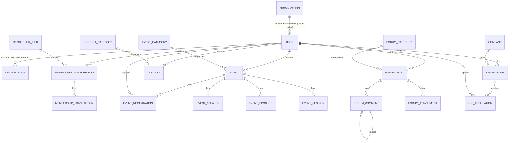

# 6. Data Model

Supersedes `docs/architecture/data-model.md`. Applies to every table under `src/db/schema/`. See [ADR-0011](../adr/0011-prisma-to-drizzle.md) for why Drizzle, and [ADR-0007](../adr/0007-single-association-tenant-seam.md) for the tenancy decision this section assumes.

## 6.1 Entity relationship diagram



## 6.2 Naming conventions

- Table names: `snake_case`, plural (`event_registrations`), set via the first argument to `pgTable(...)`.
- Column names: `snake_case` (`created_at`). The pre-Drizzle schema had no `@map` directives, so live columns were actually camelCase in Postgres; the Drizzle migration corrected this as a deliberate one-time reset with no production data to preserve.
- Drizzle object exports: `camelCase`, singular (`export const eventRegistration = pgTable(...)`), matching what `db.query.<name>` expects for the relational query API.
- Enums: `PascalCase` Postgres type name (`EventStatus`), `SCREAMING_SNAKE` values (`PUBLISHED`), unchanged from the original Prisma schema.

## 6.3 Common columns

Primary keys: application-generated UUIDs as `TEXT` (`text("id").primaryKey().$defaultFn(() => crypto.randomUUID())`), not the Postgres `uuid` type and not a database-level default — matches the original migration SQL exactly.

Audit fields: every mutable table has `created_at` and `updated_at`, both `timestamp({ withTimezone: true })`, `.notNull().defaultNow()`. `updated_at` also carries `.$onUpdate(() => new Date())`.

## 6.4 Organization

### ORGANIZATIONS

| Column                             | Type        | Nullable | Default     | Key | Notes                                         |
| ---------------------------------- | ----------- | -------- | ----------- | --- | --------------------------------------------- |
| `id`                               | text        | no       | `"default"` | PK  | Singleton row today                           |
| `name`                             | text        | no       |             |     |                                               |
| `legal_name`                       | text        | yes      |             |     |                                               |
| `logo`, `website`, `support_email` | text        | yes      |             |     |                                               |
| `locale`                           | text        | no       | `"en"`      |     |                                               |
| `currency`                         | text        | no       | `"USD"`     |     |                                               |
| `timezone`                         | text        | no       | `"UTC"`     |     |                                               |
| `settings`                         | jsonb       | no       | `{}`        |     | Deployer-configurable feature flags, branding |
| `created_at`, `updated_at`         | timestamptz | no       | now()       |     |                                               |

Example: `{ id: "default", name: "Acme Professional Association", locale: "en", currency: "USD" }`.

## 6.5 Members (Users, Roles, Auth)

### USERS

| Column                           | Type           | Nullable | Default  | Key    | Notes                                               |
| -------------------------------- | -------------- | -------- | -------- | ------ | --------------------------------------------------- |
| `id`                             | text           | no       | uuid     | PK     |                                                     |
| `username`, `email`              | text           | no       |          | unique |                                                     |
| `email_verified`                 | boolean        | no       | false    |        |                                                     |
| `first_name`, `last_name`, `bio` | text           | yes      |          |        |                                                     |
| `external_links`                 | jsonb          | yes      |          |        |                                                     |
| `role`                           | text           | no       | `"user"` | idx    | One of 14 predefined roles or a `custom_roles.name` |
| `password_hash`                  | text           | yes      |          |        | Null when auth is OAuth-only                        |
| `deleted_at`                     | timestamptz    | yes      |          | idx    | Present but unenforced today, see 6.7               |
| `name`, `image`, `display_name`  | text/text/text | mixed    |          |        | `name` required (better-auth), others optional      |

Example: `{ id: "usr_...", username: "jsmith", email: "j@example.org", role: "member_professional" }`.

### CUSTOM_ROLES

| Column                        | Type    | Nullable | Default      | Key    | Notes                              |
| ----------------------------- | ------- | -------- | ------------ | ------ | ---------------------------------- |
| `id`                          | text    | no       | uuid         | PK     |                                    |
| `name`                        | text    | no       |              | unique |                                    |
| `display_name`, `description` | text    | yes      |              |        |                                    |
| `permissions`                 | jsonb   | no       |              |        | Array of `"module:action"` strings |
| `is_system`, `is_active`      | boolean | no       | false / true |        |                                    |

### USER_ROLE_ASSIGNMENTS

| Column                      | Type             | Nullable | Default | Key                              | Notes |
| --------------------------- | ---------------- | -------- | ------- | -------------------------------- | ----- |
| `user_id`                   | text             | no       |         | FK -> users, unique with role_id |       |
| `role_id`                   | text             | no       |         | FK -> custom_roles               |       |
| `assigned_by`, `expires_at` | text/timestamptz | yes      |         |                                  |       |
| `is_active`                 | boolean          | no       | true    |                                  |       |

### ACCOUNTS, SESSIONS, VERIFICATION

Owned and read directly by better-auth's `drizzleAdapter`; their column set must keep matching what better-auth expects (`src/lib/auth/index.ts`). `verification_token` is a legacy pre-better-auth table with no current reader, flagged for removal in `TODO.md` rather than dropped here.

### AUTH_LOGS

| Column                                              | Type        | Nullable | Default | Key         | Notes                                         |
| --------------------------------------------------- | ----------- | -------- | ------- | ----------- | --------------------------------------------- |
| `id`                                                | text        | no       | uuid    | PK          |                                               |
| `user_id`                                           | text        | yes      |         | FK -> users | Nullable: some events precede a resolved user |
| `event_type`, `severity`, `message`                 | text        | no       |         |             |                                               |
| `ip_address`, `user_agent`, `device_id`, `location` | text        | yes      |         |             |                                               |
| `metadata`                                          | jsonb       | yes      |         |             |                                               |
| `timestamp`                                         | timestamptz | no       | now()   |             |                                               |

The audit log a privileged mutation writes to, in the same transaction as the mutation (Section 1.5, Section 7).

## 6.6 Events

### EVENTS

| Column                                           | Type          | Nullable | Default        | Key                    | Notes                 |
| ------------------------------------------------ | ------------- | -------- | -------------- | ---------------------- | --------------------- |
| `id`                                             | text          | no       | uuid           | PK                     |                       |
| `title`, `slug`                                  | text          | no       |                | slug unique            |                       |
| `category_id`                                    | text          | no       |                | FK -> event_categories |                       |
| `type`, `format`, `status`, `visibility`         | enum          | no       |                | idx on type/status     |                       |
| `capacity`, `registered_count`, `waitlist_count` | integer       | mixed    | 0 for counters |                        | Denormalized, see 6.7 |
| `price`                                          | numeric(10,2) | yes      |                |                        | String mode           |
| `start_time`, `end_time`                         | timestamptz   | no       |                | idx on start_time      |                       |
| `created_by`                                     | text          | no       |                | FK -> users, idx       |                       |

### EVENT_REGISTRATIONS

| Column                            | Type        | Nullable | Default     | Key                 | Notes                                 |
| --------------------------------- | ----------- | -------- | ----------- | ------------------- | ------------------------------------- |
| `user_id`, `event_id`             | text        | no       |             | FK, unique together |                                       |
| `status`                          | enum        | no       | `"PENDING"` |                     | Independent of the event's own status |
| `checked_in_at`, `checked_out_at` | timestamptz | yes      |             |                     |                                       |

`event_speakers`, `event_sponsors`, `event_sessions` follow the same shape: a `event_id` foreign key plus display fields, each with its own `updated_at`.

## 6.7 Content, Forums, Jobs

### CONTENT

| Column                         | Type        | Nullable | Default                   | Key                      | Notes                                   |
| ------------------------------ | ----------- | -------- | ------------------------- | ------------------------ | --------------------------------------- |
| `id`                           | text        | no       | uuid                      | PK                       |                                         |
| `title`, `slug`, `content`     | text        | no       |                           | slug unique              |                                         |
| `type`, `status`, `visibility` | enum        | mixed    | status defaults `"DRAFT"` | idx                      | Independent enum set from Events/Forums |
| `category_id`                  | text        | yes      |                           | FK -> content_categories |                                         |
| `author_id`                    | text        | no       |                           | FK -> users, idx         |                                         |
| `published_at`                 | timestamptz | yes      |                           | idx                      |                                         |

### FORUM_POSTS / FORUM_COMMENTS

`forum_posts.category_id` -> `forum_categories`, which carries a `required_role` gate independent of the platform's dashboard role gate (module-internal visibility rule). `forum_comments.parent_id` self-references `forum_comments.id` for arbitrary-depth threading.

### JOB_POSTINGS / JOB_APPLICATIONS

`job_postings` references four lookup tables (`job_categories`, `job_types`, `locations`, `companies`) plus `posted_by -> users`. `job_applications.status` is independent of the parent posting's `status`.

## 6.8 Counter integrity

Denormalized counters exist today (`events.registered_count`, `forum_posts.reply_count`, `job_postings.application_count`, and similar), with no mechanism keeping them in sync with the rows they count — the Drizzle migration copied these counters faithfully from the Prisma schema, and nothing writes to them yet because nothing queries these tables in real code today. **Rule for the module that eventually gets promoted**: the service layer that writes the counted rows (registrations, comments, applications) must update the counter in the same transaction, not as a follow-up write.

## 6.9 Soft delete

Only `users.deleted_at` exists today, and no code queries on it (`deletedAt: null` is never used as a filter anywhere in `src/`) — present but unenforced. A new table that needs soft delete should follow the same `deletedAt: timestamp().nullable()` shape and actually filter on it in the query layer; do not add the column without the enforcement.

## 6.10 Money

Money columns use `numeric(precision: 10, scale: 2)`, left in Drizzle's default string mode. Never use `mode: "number"` for currency columns; JS-`number` mode causes float rounding error against Postgres's `numeric` type, and a string representation round-trips exactly. Every price, amount, or salary column follows this pattern.

## 6.11 The Member / MembershipSubscription gap

`CONTEXT.md` flags this and this spec does not resolve it: a `User` whose `role` is `member`, `member_student`, `member_professional`, or `member_corporate` is a `Member` by role assignment, independent of whether that user holds an active `MembershipSubscription` to a `MembershipTier`. Nothing in the schema or code today derives one from the other. Resolving this (does a lapsed subscription downgrade the role automatically? does assigning the role require an active subscription?) is a real product decision for whoever promotes the Finance module, not a data-model detail this document can settle.

## 6.12 Migrations and seeding

`drizzle-kit` is the migration runner. Its migrations location (`out: "./drizzle"`) and schema entry point (`schema: "./src/db/schema/index.ts"`) are both paths in `drizzle.config.ts`, resolved relative to the project root, not an absolute filesystem path. The connection string comes from `process.env.DATABASE_URL`, read directly in `drizzle.config.ts` because `drizzle-kit` runs standalone, outside the Next.js process that the validated `env` export assumes.

```ts
// drizzle.config.ts (actual, current)
import { defineConfig } from "drizzle-kit";

const databaseUrl = process.env.DATABASE_URL;
if (!databaseUrl) {
  throw new Error("DATABASE_URL must be set to run drizzle-kit (see .env.example).");
}

export default defineConfig({
  schema: "./src/db/schema/index.ts",
  out: "./drizzle",
  dialect: "postgresql",
  casing: "snake_case",
  dbCredentials: { url: databaseUrl },
  strict: true,
  verbose: true,
});
```

Stable commands: `bun run db:generate` (generate a migration from the current schema diff), `bun run db:migrate` (apply tracked migrations — the only supported apply path, in development and production), `bun run db:seed` (`scripts/seed.ts`, requires `SEED_ADMIN_PASSWORD`, refuses to run without it per [ADR-0009](../adr/0009-security-hardening-p0.md)), `bun run db:reset` (`scripts/db-reset.ts` wipe, then `db:migrate && db:seed`, development only).

**Forbidden pattern**: a hardcoded absolute migration path, an inlined connection string, or a raw read/exec of one `.sql` file outside the migration ledger. This breaks inside a distroless or minimal deployment image where the operator cannot locate the files, and it applies schema changes the migration history never records.

There is one seed script today (`scripts/seed.ts`, dev admin accounts only); no separate QA seed exists (Section 5.8's open follow-up).
